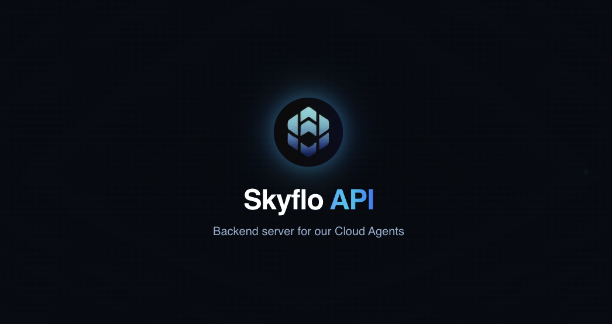

# API

<p align="center">
  
</p>

<div align="center">

  [](https://skyflo.ai)
  [](https://discord.gg/kCFNavMund)
  [](https://x.com/skyflo_ai)
  [](https://www.youtube.com/@SkyfloAI)
  [](LICENSE)
  
</div>

## Backend Server for AI-powered Cloud Agents

The Skyflo API is the central backend service for our platform, enabling secure communication between AI agents and cloud resources. It provides a robust set of RESTful endpoints for agent authentication, resource management, and real-time data processing.

## Key Features

- **Secure Agent Authentication**: JWT-based auth system with short-lived tokens and rotation
- **Webhook Infrastructure**: Reliable endpoints for cloud resource data ingestion
- **Resource Management**: Comprehensive API for cloud resource CRUD operations
- **Real-time Event Processing**: Efficient handling of continuous resource updates
- **Scalable Architecture**: Designed for high throughput and low latency

## Architecture

The API consists of several core components:

- **Authentication Layer**: Secure token management and verification
- **Resource API**: Endpoints for cloud resource management
- **Webhook Handlers**: Processing of real-time resource updates
- **Agent Management**: Provisioning and configuration of cloud agents
- **Integration Layer**: Connections to engine and knowledge store

## Tech Stack

- **Core**: Python, Django
- **Task Queue**: Celery, Flower
- **AI/ML**: Langchain
- **Databases**: PostgreSQL, Neo4j
- **Cache/Messaging**: Redis
- **Monitoring**: Prometheus, Grafana

## Getting Started

### Prerequisites

- Python 3.9+
- Docker and Docker Compose
- PostgreSQL 14+
- Redis 6+

### Local Development Setup

1. Clone the repository:
   ```bash
   git clone https://github.com/skyflo-ai/api.git
   cd api
   ```

2. Create and activate virtual environment:
   ```bash
   python -m venv venv
   source venv/bin/activate  # On Windows: .\venv\Scripts\activate
   ```

3. Install dependencies:
   ```bash
   pip install -r requirements.txt
   ```

4. Set up environment variables:
   ```bash
   cp .env.example .env
   # Edit .env with your configuration
   ```

5. Start required services:
   ```bash
   docker-compose up -d
   ```

6. Run migrations:
   ```bash
   python manage.py migrate
   ```

7. Start development server:
   ```bash
   python manage.py runserver
   ```

## API Documentation

### Base URL

```
https://api.skyflo.ai/v1
```

### Core Endpoints

1. **Agent Authentication**
   - `POST /agents/auth-key` - Creates authentication for new agent installations

2. **Agent Operations**
   - `POST /agents/{agent_id}/alive` - Agent status and initial configuration

3. **Crawl Webhooks**
   - `POST /webhooks/{provider}/{agent_id}/crawl-complete` - Initial scan results
   - `POST /webhooks/{provider}/{agent_id}/continuous-crawl` - Real-time updates

For comprehensive API documentation, see our [API Reference](https://github.com/skyflo-ai/skyflo/blob/main/docs/api.md).

## Security

The API implements multiple layers of security:

- JWT-based authentication with short-lived tokens and 30-day rotation
- Rate limiting and payload validation
- Comprehensive logging and audit trails
- TLS enforcement and secure header policies

## Contributing

We welcome contributions! Please see our [Contributing Guide](CONTRIBUTING.md) for details.

### Development Process

1. Fork the repository
2. Create your feature branch (`git checkout -b feature/amazing-feature`)
3. Commit your changes (`git commit -m 'Add amazing feature'`)
4. Push to the branch (`git push origin feature/amazing-feature`)
5. Open a Pull Request

## License

This project is licensed under the Business Source License 1.1 - see the [LICENSE](LICENSE) file for details.

## Community

- [Discord](https://discord.gg/kCFNavMund)
- [Twitter/X](https://x.com/skyflo_ai)
- [YouTube](https://www.youtube.com/@SkyfloAI)
- [GitHub Discussions](https://github.com/skyflo-ai/skyflo/discussions)

## Support

- Documentation: [docs.skyflo.ai](https://docs.skyflo.ai)
- Issues: [GitHub Issues](https://github.com/skyflo-ai/api/issues)
- Enterprise Support: [enterprise@skyflo.ai](mailto:enterprise@skyflo.ai)
